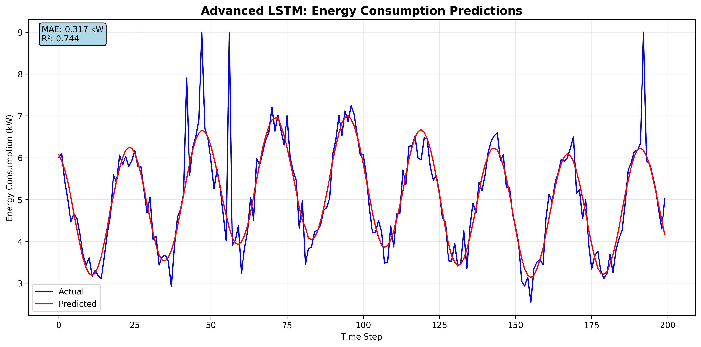

# Advanced LSTM Energy Consumption Prediction

---

## Introduction

This project implements an advanced Long Short-Term Memory (LSTM) neural network with an attention mechanism to predict hourly energy consumption. The model is trained on synthetic energy data designed to mimic real-world patterns, including daily/weekly cycles, noise, and outliers. The goal is to develop an industry-relevant time-series forecasting model for energy management, with applications in smart grids and resource optimization.

### Objectives
- Predict hourly energy consumption (kW) using a stacked LSTM with attention.
- Handle complex data patterns with noise and outliers.
- Optimize model performance through hyperparameter tuning.

### Key Features
- **Synthetic Data**: 10,000 samples with 14 features (e.g., temperature, humidity, lagged energy).
- **Model**: Stacked LSTM (3 layers, 256 hidden units) with attention mechanism.
- **Performance**: R² = 0.7441, MAPE = 6.06% on test set.
- **Outputs**: Trained model, prediction plots, loss curves, and detailed logs.

---

## Methodology

### Data Generation
The dataset is synthetically generated to simulate real-world energy consumption:
- **Samples**: 10,000 hourly data points starting from January 1, 2020.
- **Features**: 14, including energy consumption, temperature, humidity, voltage, current, power factor, reactive power, cyclic encodings (hour/day), lagged energy (1h, 24h), rolling mean, and holiday flags.
- **Patterns**: Daily (24-hour) and weekly (168-hour) cycles with added noise (σ=0.3) and 2% outliers.
- **Preprocessing**: Outlier capping (IQR method), normalization (StandardScaler for features, MinMaxScaler for target), and train/validation/test split (70%/15%/15%).

### Model Architecture
The model is a stacked LSTM with an attention mechanism to focus on relevant time steps:
- **Input Size**: 14 features.
- **LSTM Layers**: 3 layers, 256 hidden units per layer.
- **Attention**: 64-dimensional attention layer to weigh sequence importance.
- **Dropout**: 0.3 to prevent overfitting.
- **Output**: Single value predicting energy consumption (kW) for the next hour.

### Training
- **Optimizer**: AdamW with learning rate = 0.0001, weight decay = 1e-5.
- **Loss**: Mean Squared Error (MSE).
- **Hyperparameter Tuning**: Grid search over:
  - Hidden size: [128, 256, 512]
  - Sequence length: [12, 24]
  - Learning rate: [0.001, 0.0001, 0.00005]
  - Number of layers: [2, 3]
- **Early Stopping**: Patience = 15 epochs, minimum 10 epochs.
- **Batch Size**: 32, with `drop_last=True` for stability.
- **Epochs**: Up to 30 per configuration.

### Evaluation
The model is evaluated on the test set using:
- Root Mean Squared Error (RMSE)
- Mean Absolute Error (MAE)
- Mean Absolute Percentage Error (MAPE)
- R² Score

---

## Results

### Performance Metrics
- **RMSE**: 0.6429 kW
- **MAE**: 0.3175 kW
- **MAPE**: 6.06%
- **R² Score**: 0.7441

These metrics indicate the model explains ~74.4% of the variance in energy consumption, with predictions off by ~6.06% on average. The model captures daily patterns but struggles with outliers and noise, suggesting room for improvement (e.g., R² > 0.85).

### Outputs
- **Model**: `models/best_energy_lstm_model.pth` (trained model weights).
- **Plots**:
  - `prediction_analysis.png`: Actual vs. predicted energy for 200 test samples.
  - `attention_weights.png`: Attention weights for the first test sample.
  - `loss_curves.png`: Training and validation loss curves.
- **Log**: `training.log` with detailed training progress, including epoch counts and attention weight statistics.

### Visualizations
Below is an example of the prediction plot (`prediction_analysis.png`):


Check `loss_curves.png` to analyze training convergence and `attention_weights.png` to see which time steps the model prioritizes.

---

## Setup and Installation

### Prerequisites
- Python 3.13
- Libraries:
  - PyTorch (`torch`)
  - Pandas (`pandas`)
  - NumPy (`numpy`)
  - Matplotlib (`matplotlib`)
  - Scikit-learn (`sklearn`)

Install dependencies:
```bash
pip install torch pandas numpy matplotlib scikit-learn
```

### Future Improvements


- Model Capacity: Test larger hidden_size (e.g., 1024) or deeper architectures (4 layers) to improve R².


- Sequence Length: Experiment with sequence_length=48 to capture longer-term patterns.


- Attention Mechanism: Enhance attention by increasing attention_dim or using multi-head attention.


- Data: Add more features (e.g., weather forecasts) or use real-world energy data for better generalization.


- Regularization: Increase dropout_rate or weight_decay to reduce potential overfitting
